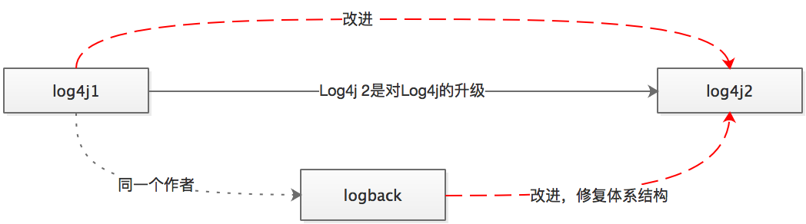

#### 主流日志实现演变历史

    Log4j2包含基于LMAX Disruptor库的下一代异步记录器。在多线程场景中，异步记录器比Log4j 1.x和Logback具有18倍的吞吐量，更低延迟的特性。具体查看官网性能比较。强烈建业切换为log4j2
    Log4j 2.4及更高版本要求Java 7，版本2.0-alpha1至2.3所需的Java 6
#### 别名或简写
* Jakarta Commons Logging（JCL）
* java.util.logging （jul） 
* Log4j12：Log4j1 （实际上指的是1.2版本）
* log4j2

#### 基本认识
* 门面：
	* slf4j：org.slf4j.Logger logger = LoggerFactory.getLogger(name)；
	* jcl：     org.apache.commons.logging.Log logger = LogFactory.getLog(name);
* 实现
	* log4j12 ：org.apache.log4j.Logger logger = Logger.getLogger(name);
	* log4j2： org.apache.logging.log4j.Logger Logger logger = LogManager.getLogger("HelloWorld");
	
 PS：[logback](https://www.slf4j.org/legacy.html) 默认与slf4j绑定，直接使用slf4j输出
 
#### 三个组件
    Logger：读取
    Appender：输出到哪
    Layout：输出样式
#### [slf4j](https://www.slf4j.org/legacy.html) [源码](https://github.com/apache/logging-log4j2)
    
   查看slf4j说明对于禁止俩jar同时出现
#### [log4j2](http://logging.apache.org/log4j/2.x/index.html)**重点水很深** [源码](log4j2)
   * [代码约束](http://logging.apache.org/log4j/2.x/javastyle.html)
   * [其他->log4j2](http://logging.apache.org/log4j/2.x/faq.html)
   *  [log4j2->其他](http://logging.apache.org/log4j/2.x/faq.html)
   *  [对于禁止俩jar同时出现,见红字](http://logging.apache.org/log4j/2.x/runtime-dependencies.html)
   *  [异步](http://logging.apache.org/log4j/2.x/manual/async.html)
  
#### 组合方式辨识
* 基本思路：
   *  log4j<指log4j2> ：log4j-x，原本使用x输出改成使用log4j2输出，后到前；
   *  slf4j ： x-[over]-slf4j, 原本使用x输出改成使用slf4j输出,前到后
   
   1. `commons-logging`+`log4j` ：使用log4j
   2. `commons-logging`+`jdk-logging(jul，java本身无需)`:使用jcl
   3. `commons-logging`+`log4j-api`+`log4j-core`+`log4j-jcl` ：使用：log4j
   4. `commons-logging（无需）`+`logback-core`+`logback-classic`+`slf4j-api`+`jcl-over-slf4j`：使用logback
   5. `commons-logging（无需）`+`jcl-over-slf4j`+`slf4j-api`：使用：无实现
   6. `slf4j-api`+`jdk-logging`+`slf4j-jdk14`：使用：jul
   7. `slf4j-api`+`log4j`+`slf4j-log4j12`：使用：log4j12
   8. `slf4j-api`+`log4j2`+`log4j-core`+`log4j-slf4j-impl`：使用：log4j2
   9. `slf4j-api`+`logback-core`+`logback-classic`：使用：logback
   10. `slf4j-api`+`commons-logging`+`slf4j-jcl`：使用：jcl
 
#### 使用注意
   1. 一般使用接口作为编码，实地输出由绑定者决定，方便实现者自由的切换。
   2. 尽可能去使用高版本替代低版本jar包。（ps：）
   3. 打印大字符串建议采用logger.isXXXXX()。

####  **2.2的log4j2版本不支持日志的自动删除，使用高版本+JAVA8**
####  参考
   - [参考1](https://my.oschina.net/pingpangkuangmo/blog/410224)  
   - [参考2](https://unmi.cc/jcl-over-slf4j-slf4j/)  